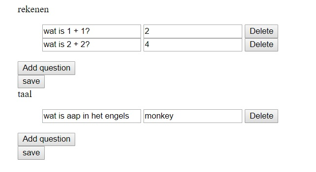
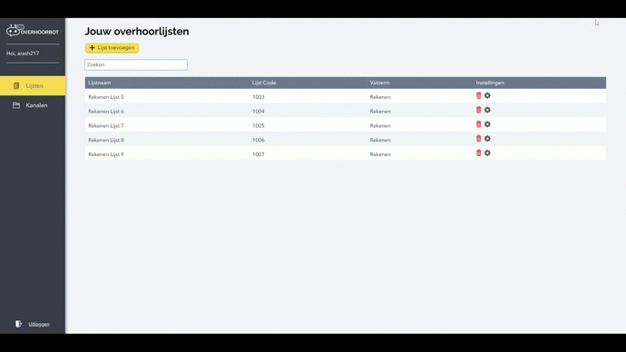

# Meesterproef-persoonlijk

## Product Biography

### Week 1

#### Kickoff

Mijn groepje bestaand uit Mitch, Guus, Nathan, Stijn en ik hadden de kickoff op maandag met Yuri (opdrachtgever) en Koop Reynders.
Yuri is een docent van de HVA en zal tijdens de minor de product owner zijn. 
Koop Reynders, een web-dev minor docent, zal de procesbegeleider zijn.
Tijdens de kickoff werd er verteld wat de opdracht is en wat er van ons verwacht wordt de komende vijf weken.
De opdracht is een overhoorbot gericht op leerlingen zodat zij ermee kunnen oefenen voor een toets.
Deze oefeningen worden aangemaakt door de leraren van de leerlingen met een content management systeem (CMS).
Voor de overhoorbot zal Google Assistant gebruikt worden om de ingevoerde oefeningen om te zetten naar spraak zodat leerlingen overhoord kunnen worden. De Google Assistant is beschikbaar als een app voor iOS en Android, maar zit ook in de Google Home, een smart speaker.

De doelen/features van de opdracht zijn als volgt:
- De bot werkt met beeld, geluid en voice
- Docent kan overhoringen maken en delen
- Docent kan normeringen instellen
- Overhoorbot kan coachen
- Automatisch woordenlijsten trainen op basis van Google Translate (optioneel)

Er zal verder rekening gehouden moeten worden met de AVG wet.
De doelgroep is namelijk minderjarig, waardoor de anonimisering van de gebruikersgegevens en het waarborgen van privacy belangrijk is.  

De opdrachtgever gaf ons tenslotte de opdracht om voor de volgende meeting - die in twee dagen is - de volgende tools te onderzoeken:
- Google Assistant
- NLP met Dialogflow
- Actions on Google
- Webhook en Firebase applicaties
- WRTS

#### Onderzoek naar tools

##### Google Assistant
Hier onderzoekte ik alleen de nauwkeurigheid van de Google Assistant, omdat ik al enigzins bekend ben met de app.
Ik ben positief verrast over de nauwkeurigheid.
De Google Assistant heeft geen moeite met het onderscheiden van woorden, cijfers, namen, etc.

##### Dialogflow
Dialogflow gebruik je om een spraak bot te maken voor Google Assistant door middel van een web interface.
Het natural language processing (NLP) gedeelte van dialogflow gebruikt machine learning en zorgt ervoor dat bots spraak kunnen begrijpen.
Dialogflow bestaat uit de volgende componenten:

###### Agent
Modules die in een app gebruikt kunnen worden om text of spraak van de gebruiker om te zetten naar gestructureerde data. Deze data kan   vervolgens gebruikt worden om een antwoord terug te geven aan de gebruiker. 

###### Intents
Een intent kan het beste omschreven worden als een dialoog.
In een intent zet je voorbeeld woorden/zinnen die de intent kunnen aanroepen, welke data er uit de spraak van de gebruiker gehaald moet worden, en hoe er vervolgens gereageerd moet worden.

###### Entities
Entities worden gebruikt om specifieke data zoals adressen, telefoonnummers, getallen, etc. uit spraak te halen. 

###### Context
Contexts worden gebruikt om de huidige staat van de gebruiker's verzoek te bewaren en om de agent informatie van de ene intent naar de andere intent te laten versturen.

###### Events
Met events kan je intents uitvoeren op basis van een gebeurtenis in plaats van de gebruiker's spraak.
Er kan gebruik gemaakt worden van verschillende platformen zoals Google Assistant, Slack, Facebook Messenger, etc. om events te  uitvoeren op basis van een gebruikeractie op het desbetreffende platform.

###### Fulfillment 
Bij een gebruikersinteractie met de bot kan een fulfillment gebruikt worden om informatie die uit de NLP gehaald wordt, te gebruiken om een dynamische antwoord te genereren aan de gebruiker met de back-end.

##### Actions on Google
Actions on Google geeft je de mogelijkheid om de Google Assistant's functionaliteit uit te breiden met zogenaamde 'Actions'.
Deze Actions laten gebruikers met spraak, acties uitvoeren zoals het aanzetten van de lichten in een kamer of het starten van een quiz.

##### Webhook en Firebase applicaties
Ik heb niet onderzoek gedaan naar firebase applicaties, omdat ik weet dat deze applicaties in de cloud gehost worden door Google.
Bij deze opdracht wil ik zo min mogelijk afhankelijk zijn van derde partijen dus zal ik mijn eigen database, server, etc. opzetten.
Met een fulfillment van Dialogflow kan er een webhook gerealiseerd worden.
Hiervoor kan er bijvoorbeeld Node.js met Express gebruikt worden.

##### WRTS
Ik heb met WRTS een simpele woordenlijst gemaakt met rekenvragen om te kijken hoe het systeem werkt.
Een woordenlijst bestaat bij WRTS uit een titel, onderwerp, de taal waar het in uitgesproken moet worden (als er gebruik gemaakt wordt van spraak) en woorden / zinnen met de desbetreffende antwoorden.
Deze woordenlijsten kan je vervolgens delen met anderen zodat zij kunnen oefenen.
Bij het starten van een overhoring krijg je eerst allerlei opties om de overhoring te configureren.
Als de overhoring eenmaal gestart is dan wordt er bij elke vraag om invoer gevraagd.
Heb je een vraag fout dan wordt deze opnieuw gevraagd totdat je het goed hebt en anders krijg je de volgende vraag.
Als je uiteindelijk alle vragen goed hebt, krijg je de score te zien.
Je cijfer wordt gebaseerd op het aantal vragen die je de eerste keer correct had.

#### Debriefing
De debriefing vond plaats op woensdag met de opdrachtgever.
Hier gingen wij in op de resultaten van het onderzoek die wij hadden uitgevoerd.
De onderzoeksresultaten van de groep waren vergelijkbaar.
De opdrachtgever verduidelijkte vervolgens dat de overhoorbot bedoeld is om WRTS te vervangen en dat de Google Assistant dus eigenlijk een bijzaak is.
Tenslotte vroeg hij of wij voor de volgende week een proof of concept konden bouwen om aan te tonen dat een overhoorbot met Google Assistant gerealiseerd kan worden. 

#### Proof of concept
Voor het proof of concept heb ik Node.js met Express gebruikt om met Dialogflow's fulfillment een webhook te realiseren, zodat de logica van de bot in de server geimplementeerd kan worden. Het werkt als volgt:

De gebruiker praat tegen de app (Bijv. Google Assistant) of Google Home, waardoor een request gestuurd wordt naar dialogflow.
Dialogflow bekijkt dan welke intent gematched moet worden en gebruikt dan de fulfillment om de verwerkte spraak data naar de back-end te sturen. In de back-end wordt er vervolgens dan de parameters uit de data gehaald, om een dynamische response terug te sturen naar dialogflow zodat de gebruiker het kan zien/horen.

In mijn proof of concept heb ik [twee intents](https://github.com/Arash217/meesterproef-1819/blob/18961ba4a2c56d5e7e347d58ceff67e1fc05a48f/controllers/dialogflowController.js). 
Één voor het [stellen van vragen](https://github.com/Arash217/meesterproef-1819/blob/18961ba4a2c56d5e7e347d58ceff67e1fc05a48f/services/dialogflowService.js) en [één voor het controleren](https://github.com/Arash217/meesterproef-1819/blob/18961ba4a2c56d5e7e347d58ceff67e1fc05a48f/services/dialogflowService.js) of de gegeven antwoorden van de gebruiker correct is. Voor het stellen van de vragen en het controleren of het antwoord correct is, gebruik ik een object met meerdere arrays. Hier staan de [vragen en hun correct antwoorden](https://github.com/Arash217/meesterproef-1819/blob/18961ba4a2c56d5e7e347d58ceff67e1fc05a48f/questions.js) in. 
Het is de bedoeling om deze data later in een database op te slaan en te beheren met een CMS.

### Week 2

#### Iteratie op proof of concept
Ik heb voortgebouwd op het proof of concept door een simpel CMS op te zetten zodat de vragen en de desbreffende antwoorden beheerd kunnen worden. Het CMS ziet er als volgt uit:

Met het CMS kan er momenteel vragen toegevoegd, gewijzigd en verwijderd worden. 
De data wordt nu opgeslagen in een [MongoDB database door middel van Mongoose](https://github.com/Arash217/meesterproef-1819/blob/9513bc6255a31ac149d59fd0feb48696eaea4035/controllers/exerciseController.js).

Het volledige flow diagram met de database:

Verder heeft het CMS een simpel registratie- en inlogpagina gekregen:

##### Registratie

##### Login

#### Voortgangsbespreking
Woensdagochtend liet ik aan de opdrachtgever het gemaakte proof of concept zien.
Hij was er enthousiast over, omdat hij een statische versie van de overhoorbot verwachtte, maar ik ging dus verder en maakte een dynamische versie door een CMS aan te koppelen.
De opdrachtgever vroeg tenslotte aan ons om de rest van de week dialogflow verder te onderzoeken en of degenen die hun proof of concept niet werkend hadden gekregen om alsnog werkend te krijgen.

#### Dialogflow intents uitwerken
Het proof of concept dat ik gemaakt heb, heeft twee intents, namelijk de vraag intent en de antwoord intent.
Echter, heeft de bot meer intents nodig zodat de gebruiker begeleid kan worden, zelf een lijst kan kiezen, de bot kan configureren, etc.
Hierdoor zijn de leden van de groep gaan samenwerken om uit te vinden welke intents nodig zijn, wat er gezegd moet worden om de intents te starten en wat de bot moet doen bij een intent. Dit hebben wij gedaan door sticky notes te gebruiken:

### Week 3

#### Intents, intents, intents....
De eerste drie dagen van deze week zijn wij als groep verder gegaan met het uitwerken van de intents voor Dialogflow en de functionaliteiten voor het CMS.
Omdat de opdrachtgever aan ons vroeg om te voldoen aan de AVG wet, en daardoor wij geen gegevens van de gebruiker mogen opslaan die te herleiden is naar de gebruiker, was het het uitwerken van een goede flow met de bot lastig. 
Uiteindelijke kwamen wij samen tot de volgende intents:

Van links naar rechts:

##### Onboarding intent
Deze intent wordt gebruikt voor het starten/configureren van de bot.

##### Add Channel intent
Met de add channel intent kan de gebruiker een kanaal toevoegen, wat als een subscriptie werkt.
Aan een kanaal kunnen er overhoorlijsten toegevoegd worden.
Als er in het CMS nieuwe lijsten toegevoegd aan een kanaal, dan zal de gebruiker van de bot, automatisch op de hoogte gehouden worden van de nieuwe lijsten. 
Kanalen worden toegevoegd middels een unieke code.

##### Get lists intent
Met deze intent kan een gebruiker aan de bot vragen welke lijsten er voor hem/haar beschikbaar zijn.

##### Add list intent
De add list intent wordt gebruikt om een lose lijst toe te voegen.
Lijsten hoeven namelijk niet verplicht gekoppeld te worden aan kanalen.
Lose lijsten worden toegevoegd middels een unieke code.

##### Quizz intent
De quizz intent wordt gebruikt voor het starten van een overhoorlijst.
Na het starten worden er vragen gesteld en de antwoorden vervolgens gecontroleerd.
De quizz stop wanneer er geen vragen meer zijn.
De gebruiker krijgt dan zijn score te horen.

#### CMS opzet
Na met de opdrachtgever gesproken te hebben over de voortgang van het project, hebben wij als groep de taken verdeeld. 
Wij hebben besloten om met mijn proof of concept verder te gaan en daarop steeds te itereren tot het eindproduct.
Ik stelde voor om een opzet te maken voor het CMS, zodat iedereen daarna een functionaliteit ervan kan oppaken en realiseren.

Voor het CMS opzet begon ik eerst met het installeren van Sass, zodat wij daarmee samen met de BEM methode een gestructureerde manier van werken zouden hebben voor het stijlen van de webpagina's.
Ik ben daarna gaan werken aan het dashboard van het CMS door dus Sass samen met BEM te gebruiken.
Beetje bij beetje begon het CMS vorm te krijgen en aan het eind van de week zag het dashboard als volgt uit:

### Week 4
Nadat ik de vorige week een opzet had gemaakt voor het CMS, gingen wij als groep de user stories voor het CMS verdelen.
Ik koos voor het aanmaken, wijzigen en zoeken van lijsten.

#### Lijsten aanmaken
Voor het aanmaken van een lijst ben ik eerst begonnen met het aanmaken van een nieuwe webpagina zodat het formulier erin gezet kan worden. Vanaf lijsten overzicht heb ik daarna een knop toegevoegd om naar deze pagina te kunnnen gaan.
Vervolgens ben ik met HTML het formulier gaan bouwen en het daarna gaan stijlen met Sass waar ik BEM ben gaan toepassen.
De gebruiker kan in dit formulier, dynamisch vragen met de betreffende antwoorden toevoegen en verwijderen.
Hiervoor heb ik dus JavaScript gebruikt.
Door middel van een 'vraag toevoegen' knop kan de gebruiker dynamisch vragen toevoegen.
Naast een vraag heb ik ook een verwijder knop toegevoegd om de vraag te verwijderen.

Na het bouwen van het formulier ben ik bezig geweest met de logica ervan in de back-end.
Hier heb ik eerst validatie toegevoegd, zodat incorrecte data niet opgeslagen wordt in database.
Daarna ben ik bezig geweest met het daadwerkelijk opslaan van de data in de database.
Indien het formulier incorrect ingevuld wordt zal de gebruiker dus de validatiefouten in het formulier zien.
En anders zal de lijst aangemaakt worden, waarna de gebruiker dan een unieke code te zien krijgt zodat hij/zij deze code kan gebruiken voor de bot.

Het aanmaken van een lijst werkt als volgt:

#### Lijsten wijzigen
Nadat ik aanmaken van lijsten af had, ging ik aan de slag met het wijzigen van lijsten.
Net als voor het aanmaken van lijsten ben ik eerst begonnen met aanmaken van een nieuwe webpagina zodat het formulier erin gezet kan worden.
Omdat de formulieren van aanmaken van lijsten en wijzigen van lijsten dezelfde zijn, deel ik het formulier tussen deze twee pagina's. Het verschil tussen deze twee pagina's is dat er bij het tonen van de wijzigen pagina de lijst gegevens ingevuld zijn.

De code in de back-end voor wijzigen van een lijsten is ook niet veel anders dan die van aanmaken van een lijst.
Echter, wordt er bij het wijzigen van een lijst geen nieuwe code gegenereerd en aan de gebruiker getoond, maar wordt de gebruiker verwezen naar de lijsten overzicht pagina na het opslaan van de wijzigingen.

Het wijzigen van een lijst werkt als volgt:

#### Lijsten zoeken

### Week 5
Ik was maandag niet aanwezig omdat ik een tentamen had.
Wel had ik maandagmiddag en -avond gewerkt aan documentatie.
Dinsdag gingen wij naar de opdrachtgever om het te hebben over het CMS, de bot en over de presentatie van aankomende donderdag.
De dagen erop heb ik mij niet veel bezig gehouden met code behalve bugfixes en heb ik daarnaast anderen geholpen bij hun problemen.
Voor de rest was het veel documenteren...

